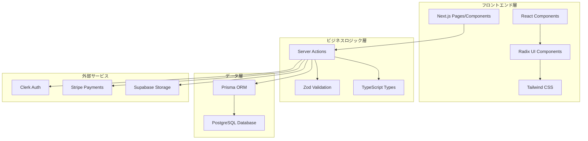
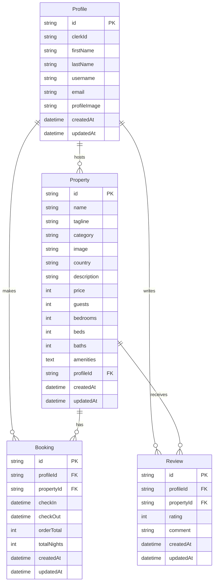
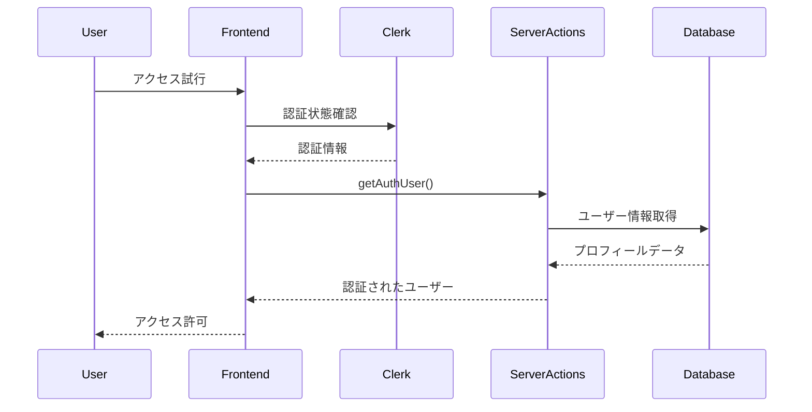
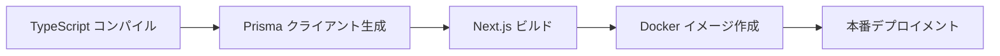

# Airbnb Clone アプリケーション - 技術仕様書

## 概要

### 目的と範囲
このドキュメントは、Next.js を使用して構築されたフルスタック物件レンタルプラットフォーム「Airbnb Clone アプリケーション」の包括的な概要を提供します。このアプリケーションは、統合された決済処理、ユーザー認証、管理機能を備えた物件の閲覧、予約、管理を可能にします。

この概要では、システムアーキテクチャ、技術スタック、コア機能、設計パターンについて説明します。

### 関連ドキュメント
- データベース設計とエンティティ関係：データベース設計
- サーバーサイドビジネスロジック実装：サーバーアクションとビジネスロジック
- ユーザーインターフェースコンポーネントとレイアウト：ユーザーインターフェース
- 個別機能実装：コア機能

## システムアーキテクチャ

アプリケーションは、プレゼンテーション層、ビジネスロジック層、データ層の明確な分離を持つモダンなフルスタックアーキテクチャに従います。システムは、すべてのビジネス操作を調整する集中化されたサーバーアクションパターンを中心に設計されています。



## 技術スタック

アプリケーションは、型安全性、開発者体験、本番環境でのスケーラビリティに最適化されたモダンな技術スタックを活用しています。

| レイヤー | 技術 | 目的 |
|----------|------|------|
| フロントエンドフレームワーク | Next.js 14.2.28 | SSR/SSGを備えたフルスタックReactフレームワーク |
| UIライブラリ | React 18.3.1 | コンポーネントベースのUIライブラリ |
| UIコンポーネント | Radix UI | アクセシブルで、スタイルなしのコンポーネントプリミティブ |
| スタイリング | Tailwind CSS | ユーティリティファーストのCSSフレームワーク |
| 型安全性 | TypeScript 5.x | 静的型チェック |
| データベースORM | Prisma 6.6.0 | 型安全なデータベースクライアント |
| データベース | PostgreSQL | リレーショナルデータベース |
| 認証 | Clerk 5.1.4 | ユーザー認証と管理 |
| 決済 | Stripe 15.12.0 | 決済処理 |
| ファイルストレージ | Supabase | 画像のためのクラウドストレージ |
| バリデーション | Zod 3.22.4 | スキーマ検証 |
| 状態管理 | Zustand 4.5.6 | 軽量な状態管理 |

## コアデータモデル

アプリケーションのデータモデルは、物件レンタルドメインを表現する5つの主要エンティティを中心としています。



## サーバーアクションアーキテクチャ

アプリケーションのビジネスロジックは、フロントエンドとバックエンドサービス間のクリーンなAPIレイヤーを提供するサーバーアクションパターンに集中化されています。

### 主要なサーバーアクション

```typescript
// 認証関連
- getAuthUser(): ユーザー認証状態の取得
- getAdminUser(): 管理者権限の確認

// プロフィール管理
- createProfileAction(): プロフィール作成
- updateProfileAction(): プロフィール更新
- updateProfileImageAction(): プロフィール画像更新

// 物件管理
- createPropertyAction(): 物件作成
- fetchProperties(): 物件一覧取得
- fetchFavoriteId(): お気に入り物件の取得
- toggleFavoriteAction(): お気に入りの切り替え

// 予約管理
- createBookingAction(): 予約作成
- deleteBookingAction(): 予約削除

// レビューシステム
- createReviewAction(): レビュー作成
- fetchPropertyReviews(): 物件レビューの取得
- deleteReviewAction(): レビュー削除
```

## 主要機能概要

アプリケーションは、以下のコア機能を備えた包括的な物件レンタルプラットフォームを提供します：

### 物件管理
- **物件作成**: 画像アップロード、アメニティ選択、価格設定を含むマルチステップフォーム
- **物件一覧**: カテゴリ組織による検索・フィルタリング可能な物件カタログ
- **物件詳細**: 画像ギャラリー、マップ、予約インターフェースを備えたリッチな物件ページ

### ユーザー管理
- **認証**: プロフィール管理を備えたClerkパワードの認証
- **ユーザープロフィール**: 画像アップロードと個人情報を含むカスタマイズ可能なプロフィール
- **ロールベースアクセス**: ゲスト、ホスト、管理者のための差別化された体験

### 予約システム
- **日付選択**: 利用可能性チェック機能付きのインタラクティブカレンダー
- **価格計算**: 税金と手数料計算を含む動的価格設定
- **決済処理**: 確認機能付きのStripe統合チェックアウトフロー

### レビューと評価システム
- **物件レビュー**: 5つ星評価を備えたユーザー生成レビュー
- **レビュー管理**: ユーザー自身のレビューのCRUD操作
- **集計評価**: 計算された平均評価とレビュー数

### 管理機能
- **管理ダッシュボード**: チャートとメトリクスを含む統計概要
- **ユーザー管理**: ユーザーと物件の管理監督
- **分析**: 予約トレンドと収益追跡

## 認証と認可

アプリケーションは、ロールベースアクセスコントロールとルート保護を備えたClerkを使用した堅牢な認証システムを実装しています。

### 認証フロー



### 権限レベル
- **ゲストユーザー**: 物件閲覧、予約作成
- **認証ユーザー**: プロフィール管理、レビュー作成、お気に入り管理
- **ホストユーザー**: 物件作成・管理
- **管理者**: 全システム管理、統計閲覧

## 開発とデプロイメント

アプリケーションは、適切なビルド最適化と環境処理を備えた本番デプロイメント用にDockerを使用してコンテナ化されています。

### ビルドプロセス



### 主要設定ファイル

#### Docker設定
```dockerfile
# Multi-stage build with Alpine Linux base
FROM node:18-alpine AS base
WORKDIR /app
COPY package*.json ./
RUN npm ci --only=production

FROM base AS build
RUN npm ci
COPY . .
RUN npm run build

FROM base AS runtime
COPY --from=build /app/.next ./.next
COPY --from=build /app/public ./public
EXPOSE 3000
CMD ["npm", "start"]
```

#### データベース設定
- **接続**: PostgreSQL データベース
- **ORM**: Prisma クライアント
- **マイグレーション**: Prisma マイグレーション

#### 依存関係管理
- **開発スクリプト**: `npm run dev`, `npm run build`
- **データベーススクリプト**: `prisma generate`, `prisma migrate`
- **型生成**: TypeScript および Prisma 型生成

## パフォーマンス最適化

### フロントエンド最適化
- **Server-Side Rendering (SSR)**: 初期ページロードの高速化
- **Static Site Generation (SSG)**: 静的コンテンツの事前生成
- **Image Optimization**: Next.js の最適化された画像コンポーネント
- **Code Splitting**: 動的インポートによるバンドルサイズ削減

### データベース最適化
- **インデックス**: 頻繁にクエリされるフィールドのインデックス作成
- **リレーション**: 効率的なJOIN操作
- **キャッシュ**: クエリ結果のキャッシュ戦略

## セキュリティ考慮事項

### データ保護
- **入力検証**: Zod スキーマによる厳密な検証
- **SQL インジェクション防止**: Prisma ORM の使用
- **認証トークン**: Clerk による安全なトークン管理

### プライバシー
- **GDPR 準拠**: ユーザーデータの適切な管理
- **データ暗号化**: 機密情報の暗号化
- **アクセスログ**: セキュリティ監査のためのログ記録

## 今後の拡張計画

### 機能拡張
- **多言語サポート**: i18n 国際化対応
- **モバイルアプリ**: React Native による モバイルアプリ開発
- **AI 推奨システム**: 機械学習による物件推奨

### インフラストラクチャ拡張
- **マイクロサービス化**: サービス指向アーキテクチャへの移行
- **CDN 統合**: グローバルコンテンツ配信
- **監視システム**: アプリケーションパフォーマンス監視

---

## 参考資料

- **ソースファイル**: `utils/actions.ts`, `package.json`, `prisma/schema.prisma`
- **設定ファイル**: `Dockerfile`, 各種設定ファイル
- **外部サービス**: Clerk, Stripe, Supabase 公式ドキュメント

[For more info](https://deepwiki.com/myoshi2891/AirbnbCloneApp)
