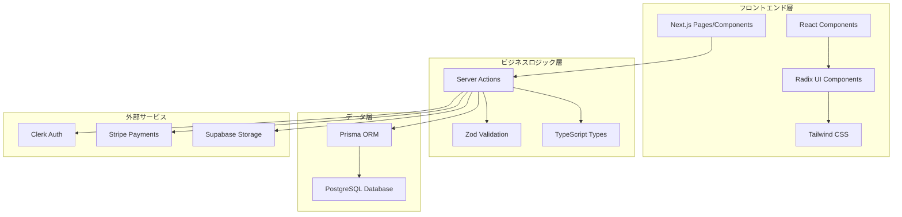
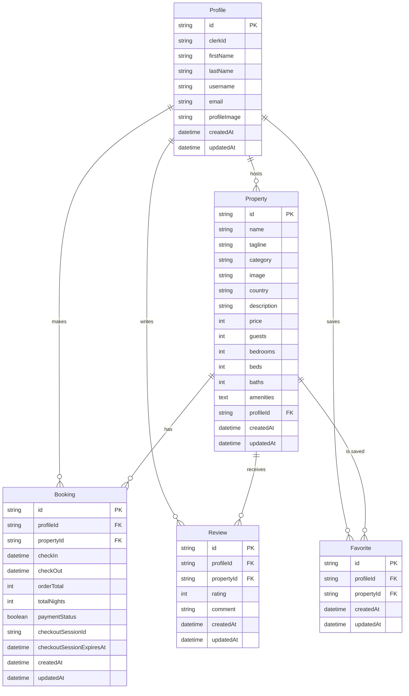
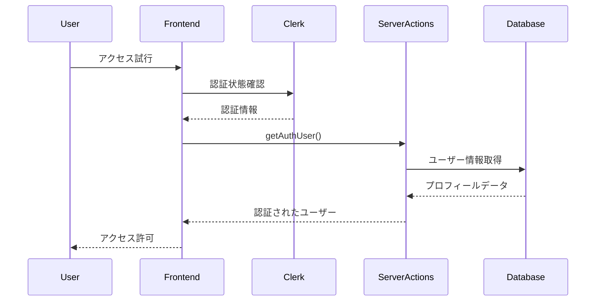
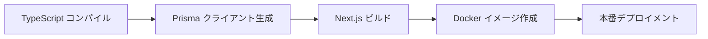

# Airbnb Clone アプリケーション - 技術仕様書

## 概要

### 目的と範囲

このドキュメントは、Next.js を使用して構築されたフルスタック物件レンタルプラットフォーム「Airbnb Clone アプリケーション」の包括的な概要を提供します。このアプリケーションは、統合された決済処理、ユーザー認証、管理機能を備えた物件の閲覧、予約、管理を可能にします。

この概要では、システムアーキテクチャ、技術スタック、コア機能、設計パターンについて説明します。

### 関連ドキュメント

- データベース設計とエンティティ関係：データベース設計
- サーバーサイドビジネスロジック実装：サーバーアクションとビジネスロジック
- ユーザーインターフェースコンポーネントとレイアウト：ユーザーインターフェース
- 個別機能実装：コア機能

## システムアーキテクチャ

アプリケーションは、プレゼンテーション層、ビジネスロジック層、データ層の明確な分離を持つモダンなフルスタックアーキテクチャに従います。システムは、すべてのビジネス操作を調整する集中化されたサーバーアクションパターンを中心に設計されています。


```mermaid
graph TB
    subgraph "フロントエンド層"
        A[Next.js Pages/Components]
        B[React Components]
        C[Radix UI Components]
        D[Tailwind CSS]
    end
    
    subgraph "ビジネスロジック層"
        E[Server Actions]
        F[Zod Validation]
        G[TypeScript Types]
    end
    
    subgraph "データ層"
        H[Prisma ORM]
        I[PostgreSQL Database]
    end
    
    subgraph "外部サービス"
        J[Clerk Auth]
        K[Stripe Payments]
        L[Supabase Storage]
    end
    
    A --> E
    B --> C
    C --> D
    E --> F
    E --> G
    E --> H
    H --> I
    E --> J
    E --> K
    E --> L
```

## 技術スタック

アプリケーションは、型安全性、開発者体験、本番環境でのスケーラビリティに最適化されたモダンな技術スタックを活用しています。

| レイヤー | 技術 | 目的 |
| ---------- | ------ | ------ |
| フロントエンドフレームワーク | Next.js 15.5.18 | App RouterとServer Componentsを備えたフルスタックReactフレームワーク |
| UIライブラリ | React 19.2.7 | コンポーネントベースのUIライブラリ |
| UIコンポーネント | Radix UI | アクセシブルで、スタイルなしのコンポーネントプリミティブ |
| スタイリング | Tailwind CSS | ユーティリティファーストのCSSフレームワーク |
| 型安全性 | TypeScript 5.x | 静的型チェック |
| データベースORM | Prisma 6.6.0 | 型安全なデータベースクライアント |
| データベース | PostgreSQL | リレーショナルデータベース |
| 認証 | Clerk 6.39.x | ユーザー認証と管理 |
| 決済 | Stripe 15.12.0 | 決済処理 |
| ファイルストレージ | Supabase | 画像のためのクラウドストレージ |
| バリデーション | Zod 4.4.3 | スキーマ検証 |
| 状態管理 | Zustand 5.0.14 | 軽量な状態管理 |

## コアデータモデル

アプリケーションのデータモデルは、物件レンタルドメインを表現する5つの主要エンティティを中心としています。


```mermaid
erDiagram
    Profile {
        string id PK
        string clerkId
        string firstName
        string lastName
        string username
        string email
        string profileImage
        datetime createdAt
        datetime updatedAt
    }
    
    Property {
        string id PK
        string name
        string tagline
        string category
        string image
        string country
        string description
        int price
        int guests
        int bedrooms
        int beds
        int baths
        text amenities
        string profileId FK
        datetime createdAt
        datetime updatedAt
    }
    
    Booking {
        string id PK
        string profileId FK
        string propertyId FK
        datetime checkIn
        datetime checkOut
        int orderTotal
        int totalNights
        boolean paymentStatus
        string checkoutSessionId
        datetime checkoutSessionExpiresAt
        datetime createdAt
        datetime updatedAt
    }

    Favorite {
        string id PK
        string profileId FK
        string propertyId FK
        datetime createdAt
        datetime updatedAt
    }
    
    Review {
        string id PK
        string profileId FK
        string propertyId FK
        int rating
        string comment
        datetime createdAt
        datetime updatedAt
    }
    
    Profile ||--o{ Property : "hosts"
    Profile ||--o{ Booking : "makes"
    Profile ||--o{ Review : "writes"
    Property ||--o{ Booking : "has"
    Property ||--o{ Review : "receives"
    Profile ||--o{ Favorite : "saves"
    Property ||--o{ Favorite : "is saved"
```

## サーバーアクションアーキテクチャ

アプリケーションのビジネスロジックは、フロントエンドとバックエンドサービス間のクリーンなAPIレイヤーを提供するサーバーアクションパターンに集中化されています。

### 主要なサーバーアクション

```typescript
// 認証関連
- getAuthUser(): ユーザー認証状態の取得
- getAdminUser(): 管理者権限の確認

// プロフィール管理
- createProfileAction(): プロフィール作成
- updateProfileAction(): プロフィール更新
- updateProfileImageAction(): プロフィール画像更新

// 物件管理
- createPropertyAction(): 物件作成
- fetchProperties(): 物件一覧取得
- fetchFavoriteId(): お気に入り物件の取得
- toggleFavoriteAction(): お気に入りの切り替え

// 予約管理
- createBookingAction(): 予約作成
- deleteBookingAction(): 予約削除

// レビューシステム
- createReviewAction(): レビュー作成
- fetchPropertyReviews(): 物件レビューの取得
- deleteReviewAction(): レビュー削除
```

## 主要機能概要

アプリケーションは、以下のコア機能を備えた包括的な物件レンタルプラットフォームを提供します：

### 物件管理

- **物件作成**: 画像アップロード、アメニティ選択、価格設定を含む入力フォーム
- **物件一覧**: カテゴリ組織による検索・フィルタリング可能な物件カタログ
- **物件詳細**: 1枚のメイン画像、国単位の位置を示すマップ、予約インターフェースを備えた物件ページ

### ユーザー管理

- **認証**: プロフィール管理を備えたClerkパワードの認証
- **ユーザープロフィール**: 画像アップロードと個人情報を含むカスタマイズ可能なプロフィール
- **アクセス制御**: 認証状態、物件所有者、`ADMIN_USER_ID`に基づく操作制御

### 予約システム

- **日付選択**: 利用可能性チェック機能付きのインタラクティブカレンダー
- **価格計算**: 税金と手数料計算を含む動的価格設定
- **決済処理**: 確認機能付きのStripe統合チェックアウトフロー

### Stripe決済フロー

1. `app/api/payment/route.ts`が認証済みユーザー所有のBookingを検証し、埋め込みCheckout Sessionを作成または再利用する。
2. `app/api/webhook/route.ts`が署名を検証し、`checkout.session.completed`と`checkout.session.async_payment_succeeded`で支払い済みBookingを冪等に確定する。
3. `app/api/confirm/route.ts`がCheckoutのreturn URLを処理し、Sessionを再取得して支払い済みなら確定、未確定ならpending画面へ案内する。

### レビューと評価システム

- **物件レビュー**: 5つ星評価を備えたユーザー生成レビュー
- **レビュー管理**: ユーザー自身のレビューの作成と削除
- **集計評価**: 計算された平均評価とレビュー数

### 管理機能

- **管理ダッシュボード**: チャートとメトリクスを含む統計概要
- **アクセス制御**: `ADMIN_USER_ID`で保護された統計画面
- **分析**: 予約トレンドと収益追跡

## 認証と認可

アプリケーションは、ロールベースアクセスコントロールとルート保護を備えたClerkを使用した堅牢な認証システムを実装しています。

### 認証フロー


```mermaid
sequenceDiagram
    participant User
    participant Frontend
    participant Clerk
    participant ServerActions
    participant Database
    
    User->>Frontend: アクセス試行
    Frontend->>Clerk: 認証状態確認
    Clerk-->>Frontend: 認証情報
    Frontend->>ServerActions: getAuthUser()
    ServerActions->>Database: ユーザー情報取得
    Database-->>ServerActions: プロフィールデータ
    ServerActions-->>Frontend: 認証されたユーザー
    Frontend-->>User: アクセス許可
```

### 権限レベル

- **ゲストユーザー**: 物件閲覧、予約作成
- **認証ユーザー**: プロフィール管理、レビュー作成、お気に入り管理
- **ホストユーザー**: 物件作成・管理
- **管理者**: 統計閲覧

## 開発とデプロイメント

アプリケーションは、適切なビルド最適化と環境処理を備えた本番デプロイメント用にDockerを使用してコンテナ化されています。

### ビルドプロセス


```mermaid
flowchart LR
    A[TypeScript コンパイル] --> B[Prisma クライアント生成]
    B --> C[Next.js ビルド]
    C --> D[Docker イメージ作成]
    D --> E[本番デプロイメント]
```

### 主要設定ファイル

#### Docker設定

```dockerfile
FROM oven/bun:1.3.12-alpine AS builder
WORKDIR /app
COPY package.json bun.lock ./
RUN bun ci
COPY . .
RUN bun run build

FROM node:20-alpine AS runner
WORKDIR /app
COPY --from=builder /app/.next/standalone ./
COPY --from=builder /app/.next/static ./.next/static
EXPOSE 3000
CMD ["node", "server.js"]
```

#### データベース設定

- **接続**: PostgreSQL データベース
- **ORM**: Prisma クライアント
- **マイグレーション**: Prisma マイグレーション

#### 依存関係管理

- **パッケージマネージャー**: Bun 1.3.12（`bun.lock` が唯一のロックファイル）
- **再現可能インストール**: CI / Docker ともに `bun ci`
- **Docker公開設定**: `NEXT_PUBLIC_CLERK_PUBLISHABLE_KEY`、`NEXT_PUBLIC_STRIPE_PUBLISHABLE_KEY`、`NEXT_PUBLIC_WEBSITE_URL`をbuild argで渡す（サーバー用秘密値は渡さない）
- **開発スクリプト**: `bun run dev`, `bun run build`
- **Compose設定検証**: `bun run compose:check`（`.env`を展開・出力しない）
- **データベーススクリプト**: `bunx prisma generate`, `bunx prisma migrate dev`（開発）, `bunx prisma migrate deploy`（本番）
- **型生成**: TypeScript および Prisma 型生成

## パフォーマンス最適化

### フロントエンド最適化

- **Server-Side Rendering (SSR)**: 初期ページロードの高速化
- **Server Components**: 読み取り処理をサーバー側に集約
- **Image Optimization**: Next.js の最適化された画像コンポーネント
- **Code Splitting**: 動的インポートによるバンドルサイズ削減

### データベース最適化

- **バッチ取得**: 一覧の評価・お気に入り・予約集計でN+1クエリを回避
- **ページネーション**: 一覧クエリの取得件数を制限
- **キャッシュ**: 匿名の物件一覧だけをタグ付きでキャッシュ

## セキュリティ考慮事項

### データ保護

- **入力検証**: Zod スキーマによる厳密な検証
- **SQL インジェクション防止**: Prisma ORM の使用
- **認証トークン**: Clerk による安全なトークン管理

## 今後の拡張計画

### 機能拡張

- **多言語サポート**: i18n 国際化対応
- **モバイルアプリ**: React Native による モバイルアプリ開発
- **AI 推奨システム**: 機械学習による物件推奨

### インフラストラクチャ拡張

- **マイクロサービス化**: サービス指向アーキテクチャへの移行
- **CDN 統合**: グローバルコンテンツ配信
- **監視システム**: アプリケーションパフォーマンス監視

---

## 参考資料

- **ソースファイル**: `utils/actions.ts`, `package.json`, `prisma/schema.prisma`
- **設定ファイル**: `Dockerfile`, 各種設定ファイル
- **外部サービス**: Clerk, Stripe, Supabase 公式ドキュメント

[For more info](https://deepwiki.com/myoshi2891/AirbnbCloneApp)
